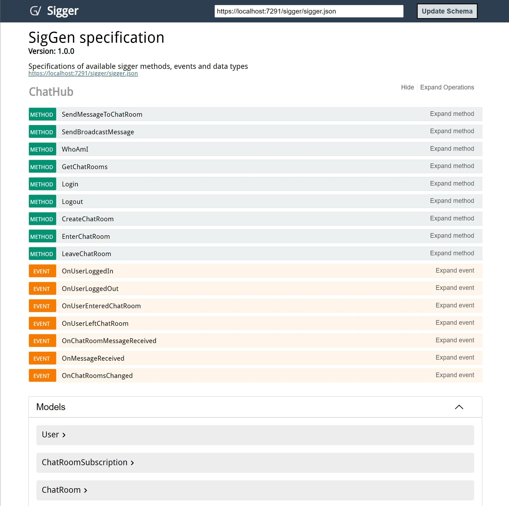

# Sigger UI

To enable easy testing of hubs, sigger provides an integrated web interface called Sigger-UI 
which provides documentation and a test environment for all configured hubs.

## Installation

Sigger UI does not require a separate installation as it is included in the Sigger nuget package.

## Usage

To include Sigger-UI only the registration of the middleware in the Pgrogram Startup is necessary. 

```c#
    public class Startup
    {
        public void Configure(IApplicationBuilder app)
        {
            // add sigger middleware
            app.UseSigger();
            // add sigger-ui middleware
            app.UseSiggerUI();
        }
    }
```

With these default settings, you can now visit the interface via:
```
http[s]://yoururl:yourport/sigger/
```


