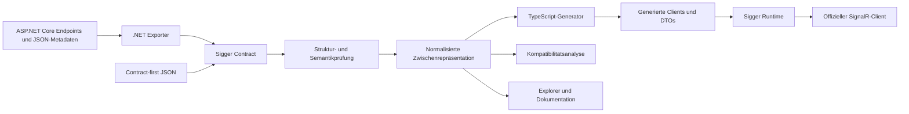

# Sigger V2 – Vertragsstandard und Developer-Experience-Plattform für SignalR

Status: **Architektur- und Spezifikationsentwurf zur Umsetzung**, Stand 7. September 2026. Die beschriebenen V2-Pakete, Befehle und APIs sind Zielentwürfe und noch nicht implementiert. Paketnamen sind Arbeitsnamen; ihre Verfügbarkeit in Registries ist nicht geprüft.

## 1. Produktidee und zentrale Entscheidung

Sigger macht eine SignalR-API zu einem expliziten, versionierbaren und überprüfbaren Vertrag. Aus diesem Vertrag entstehen typsichere Clients, verständliche Dokumentation, interaktive Testmöglichkeiten und automatisierte Kompatibilitätsprüfungen. Änderungen am Backend werden bereits im Entwicklungsprozess sichtbar, bevor sie im Browser als Laufzeitfehler auftreten.

V2 ist ein Neuentwurf. Die wertvolle ursprüngliche Idee – Hub → Beschreibung → Client → Testoberfläche – bleibt erhalten. Das CLR-orientierte V1-Metamodell und die enge Bindung an Angular werden ersetzt.

Die Architektur hat drei getrennte Verantwortlichkeiten:

1. **Sigger Contract:** ein offenes Dokumentformat für die tatsächlich übertragenen SignalR-Operationen und Daten.
2. **Sigger Toolchain:** Extraktion, Validierung, Normalisierung, Vergleich, Codegenerierung und Dokumentation.
3. **Sigger SDK:** eine kleine, getestete Laufzeitbibliothek mit generierten, dünnen Clients und optionalen Framework-Adaptern.

Der Standard MUSS ohne die Referenzimplementierung nutzbar sein. Ein unabhängiger Generator darf weder .NET laden noch interne Sigger-Typflags kennen müssen. Ein normaler SignalR-Client MUSS weiterhin mit einem durch Sigger beschriebenen Hub kommunizieren können.

### 1.1 Zielgruppen und Erfolg

| Zielgruppe | V2 löst konkret |
| --- | --- |
| Backend-Entwicklung | Tatsächliche Hub-Schnittstelle veröffentlichen; problematische Verträge früh erkennen |
| Frontend-Entwicklung | Autovervollständigung, korrekte DTOs, klare Fehler und nachvollziehbarer Verbindungszustand |
| API-Verantwortliche | Reviews, Release-Versionierung und Kompatibilitätsnachweise |
| QA und Integration | Hubs ohne eigene Testanwendung ausprobieren; reproduzierbare Vertragsfälle ausführen |
| Tool-Autoren | Dokumentierter Standard, stabile Referenzen und gemeinsame Konformitätsfixtures |

Als Produktziel soll ein neues Chat-Beispiel nach Installation der Voraussetzungen in unter zehn Minuten bis zum ersten typisierten Aufruf nutzbar sein. Dies ist im Beta-Usability-Test zu messen, keine behauptete Eigenschaft der bestehenden Software.

### 1.2 Umfang und Grenzen

V2.0 umfasst ASP.NET Core SignalR mit JSON, .NET-Code-first-Export, dateibasiertes Contract-first-Authoring, TypeScript-Codegenerierung, Runtime, React mit klassischen Hooks und optionaler TanStack-Query-Integration, Angular-/RxJS-Integration, CLI, Explorer und Kompatibilitätsprüfung. React und Angular sind gleichwertige unterstützte Integrationen; TanStack Query ist keine Voraussetzung für React. Aufrufe, Events sowie Download-, Upload- und bidirektionales Streaming gehören zum Releaseumfang; eine frühe Vorschau darf weniger unterstützen, MUSS dies aber explizit deklarieren.

Nicht zum V2.0-Umfang gehören ein eigener WebSocket-Transport, Broker, persistente Nachrichtenzustellung, automatisch synchronisierter Anwendungszustand, automatische fachliche Wiederholungen, generierte Serverimplementierungen und vollständige Serialisierbarkeit beliebigen .NET-Codes. MessagePack, weitere Zielsprachen, Vue-Adapter und Client-Result-RPC sind Erweiterungen nach V2.0.

## 2. Bestandsaufnahme im Repository

Die folgenden Befunde beruhen auf Quellcodeinspektion des aktuellen Arbeitsverzeichnisses. Backend-Build und Laufzeittests wurden für diesen Dokumententwurf nicht ausgeführt. Das Repository enthält bereits Modernisierungen wie mehrere .NET-Zielframeworks, CI und Sicherheitsoptionen; „alt“ beschreibt vor allem die konzeptionelle Basis.

| Bereich und Quelle | Befund | Konsequenz für V2 |
| --- | --- | --- |
| [README](../README.md), [Getting Started](GettingStarted.md) | Durchgehende Hub-/Schema-/Angular-/UI-Idee vorhanden | Diesen vollständigen Workflow zur primären Produktoberfläche machen |
| [Schema-Typ](../backend/src/Sigger.Abstractions/Schema/TypeDefinition.cs), [Hub](../backend/src/Sigger.Abstractions/Schema/HubDefinition.cs) | `exportedType`, numerische Flags und Typdefinitionen pro Hub | Standardisierte Nutzdatenschemas und dokumentweite Referenzen |
| [CodeParser](../backend/src/Sigger.Generator/Parser/CodeParser.cs) | Reflection-basierte Memberanalyse; komplexe Typen/Arrays pauschal nullable; asynchrone Task-Erkennung im Typmodell | Effektiven Transportvertrag analysieren; Nullability von Property-Anwesenheit trennen |
| [CodeParser](../backend/src/Sigger.Generator/Parser/CodeParser.cs) | Ungeeignete Typen können zum stillen Überspringen führen; eigener Pfad für Eventinterfaces | Fehler mit Quellposition; keine still verschwundenen Operationen |
| [SchemaGenerator](../backend/src/Sigger.Generator/SchemaGenerator.cs) | Eigene Namensformatierung; serialisierte DTO-Namen werden nicht aus dem effektiven JSON-Vertrag abgeleitet | Serializer ist maßgeblich; API-Name und Wire-Name getrennt |
| [Generatorauswahl](../client/sigger-gen/lib/sigger-generator.js) | Nur Angular wird als Framework ausgewählt | TypeScript-Core zuerst, Frameworks als Adapter |
| [Angular-Generator](../client/sigger-gen/lib/sigger-ng-generator.js) | Verbindungslogik als erzeugte Strings; `keepValue` bestimmt Subject-Art; Default im Parser ist `KeepLastValue` | Laufzeitverhalten zentral testen; Replay ausdrücklich konfigurieren und begrenzen |
| [TypeScript-Generator](../client/sigger-gen/lib/sigger-ts-generator.js) | Stringbasierte Dateierzeugung und Modellimporte | Normalisierte Zwischenrepräsentation, sprachgerechtes Escaping und deterministische Ausgabe |
| [Registrierung](../backend/src/Sigger.Generator/StartupExtensions.cs), [Optionen](../backend/src/Sigger.Generator/Server/SiggerGenOptions.cs) | `WithHub` registriert Pfad und Hub über Sigger; Schema-Endpoint standardmäßig `Always` | Native Endpoint-Routing-Erweiterung; explizite Veröffentlichung |
| [Event-UI](../backend/src/Sigger.UI/Client/sigger-ui/src/EventDecl.svelte) | Eigene Subscription-Verwaltung mit `off(eventName)` | Exakte Handleridentität und klarer Ressourcenbesitz |
| [Registry](../backend/src/Sigger.Extensions/Registry/SiggerRepository.cs) | Zusätzliche lokale Connection-/Topic-Verwaltung | Fachliche Presence-/Topic-Hilfen aus dem Vertragskern heraushalten |
| [Backendtests](../backend/test/Sigger.GeneratorTest), [CI](../.github/workflows/ci.yml) | Parser-/Generatorfälle und CI vorhanden | Als Regressionseingaben weiterverwenden, um echte Wire-Tests ergänzen |
| [npm-Konfiguration](../client/sigger-gen/package.json) | Testscript referenziert `test/parser.test.mjs`; diese Datei fehlt im untersuchten Arbeitsverzeichnis | Testpipeline bei Implementierungsbeginn zunächst ausführbar herstellen |
| [Sicherheit](../SECURITY.md) | TLS-Prüfung und konfigurierbare Sichtbarkeit bereits berücksichtigt | Sichere Defaults konsistent in allen Werkzeugen fortführen |

Diese Bestandsaufnahme ersetzt kein vollständiges Bug- oder Security-Audit. Insbesondere müssen aktuelle Parserregeln in der Migration gegen reale SignalR-Bindung verifiziert werden.

## 3. Verhältnis zu bestehenden Standards

OpenAPI beschreibt HTTP-APIs. Sigger übernimmt die Idee einer unabhängig nutzbaren Beschreibung mit Tooling, modelliert Hubaufrufe aber nicht als künstliche HTTP-Routen. [OpenAPI-Spezifikation](https://spec.openapis.org/oas/v3.2.0.html)

AsyncAPI beschreibt nachrichtengetriebene APIs mit Channels, Messages, Operations und Protokollbindings. Für Sigger ist das eine wichtige Interoperabilitätsgrenze. **Entwurfsentscheidung:** V2 definiert zunächst einen kompakten SignalR-spezifischen Vertrag; ein späterer AsyncAPI-Export muss nicht darstellbare Informationen ausdrücklich als Erweiterungen oder Verluste ausweisen. Ein verlustfreier Roundtrip wird nicht versprochen. [AsyncAPI 3.0](https://www.asyncapi.com/docs/reference/specification/v3.0.0)

Nutzdaten werden mit einem definierten Profil von JSON Schema Draft 2020-12 beschrieben. Es gibt keine zweite Sigger-Typsprache für Arrays, Objekte, Enums oder Null. SignalR-Framing und Transport bleiben beim offiziellen Protokoll. [JSON Schema Core](https://json-schema.org/draft/2020-12/json-schema-core), [SignalR Hub Protocol](https://github.com/dotnet/aspnetcore/blob/main/src/SignalR/docs/specs/HubProtocol.md)

„Standard“ bezeichnet hier den angestrebten offenen Projektstandard. Eine externe Standardisierung oder Anerkennung wird nicht behauptet.

## 4. Normative Begriffe und Versionierung

**MUSS / DARF NICHT** sind verbindliche Anforderungen dieses Entwurfs. **SOLL** erlaubt begründete, dokumentierte Abweichungen. **KANN** bezeichnet optionale Fähigkeiten.

Vier Versionen bleiben unabhängig:

| Version | Zweck |
| --- | --- |
| `sigger: "2.0.0"` | Version des Dokumentformats |
| `info.version` | SemVer-Version der beschriebenen Anwendungs-API |
| Tool-/Paketversion | Version von Exporter, Generator oder Runtime |
| Lockfile-Formatversion | Aufbau der reproduzierbaren Generierungsinformationen |

Unbekannte Major- oder Minor-Versionen des Vertrags MUSS ein V2.0-Werkzeug ablehnen. Patch-Versionen dürfen keine neue maschinenrelevante Semantik einführen. Unbekannte Pflichtfähigkeiten führen ebenfalls zum Fehler. Damit wird Unvollständigkeit nicht versehentlich als erfolgreiche Generierung ausgegeben.

V2 ist nicht schemakompatibel zu V1. Ein neues V2-SDK verlangt jedoch keine neue Hubroute, solange der tatsächliche Wire-Vertrag unverändert bleibt.

## 5. Vertragsformat

### 5.1 Dokument und Referenzen

Die kanonische Austauschform ist UTF-8-JSON. YAML 1.2 mit ausschließlich JSON-kompatiblen Werten KANN als Autorenformat gelesen werden; doppelte Schlüssel und benutzerdefinierte Tags sind Fehler. Werkzeuge akzeptieren keine mehrdeutigen JSON-Objekte mit doppelten Schlüsseln.

| Feld | Pflicht | Definition |
| --- | --- | --- |
| `sigger` | Ja | Formatversion |
| `info` | Ja | `id` als stabile absolute URI, `title`, `version`; optional `description` |
| `requiredCapabilities` | Ja | Liste benötigter registrierter Profilkennungen |
| `servers` | Nein | Map aus ID auf `{ url, description? }`; `url` absolute HTTP(S)-Basis-URL ohne Query/Fragment |
| `hubs` | Ja | Map aus stabiler Hub-ID auf Hubobjekt; mindestens ein Hub |
| `components` | Ja | Objekt mit `schemas`-Map; optional `securitySchemes`-Map |

Map-IDs für Hubs, Operationen, Server und Komponenten erfüllen `[A-Za-z][A-Za-z0-9._-]*`. Operations-IDs sind innerhalb eines Hubs eindeutig; ihre globale Identität ist `info.id + hubId + operationId`. IDs werden bei CLR-Umbenennungen nicht automatisch geändert. Der Exporter bietet dafür explizite Metadaten.

Alle Sigger-Strukturobjekte lehnen unbekannte Felder ab, außer `x-…`-Erweiterungen. Diese dürfen Standardsemantik nicht überschreiben. Muss eine Erweiterung verstanden werden, benötigt sie eine deklarierte Capability. Im Nutzdatenschema gelten stattdessen die Regeln des JSON-Schema-Profils.

V2.0-Artefakte sind selbstständig: `$ref` MUSS auf `#/components/schemas/<id>` verweisen und ein vollständiges Komponentenschema adressieren. Keine entfernten Referenzen, `$id`, `$anchor`, `$dynamicRef` oder impliziten Netzwerkzugriffe. Rekursive lokale Referenzen sind erlaubt; Werkzeuge müssen Zyklen erkennen und dürfen Schemas nicht endlos expandieren. Spätere Bundler dürfen Autorenreferenzen auflösen, müssen aber ein solches eigenständiges Artefakt ausgeben.

### 5.2 Hubobjekt

Pflichtfelder: `path`, `protocol`, `operations`. Optional: `description`, `security`, `deprecated`. `protocol` ist in V2.0 exakt `signalr.json.v1`. `operations` ist eine Map; eine leere Map ist erlaubt.

`path` beginnt mit `/` und enthält eine literale Hubroute ohne Schema-Endpoint, Query, Fragment oder Routenplatzhalter. Hosting unter einem Anwendungspfad wird über die Serverbasis abgebildet. Auflösung bedeutet: Basis ohne abschließenden Slash plus Hubpfad; `https://example.test/app/` und `/hubs/chat` ergeben `https://example.test/app/hubs/chat`. Dies ist ausdrücklich nicht das Überschreiben des Basispfads durch `new URL('/hubs/chat', base)`.

Eine explizite `hubUrl` in der Runtime ersetzt diese Auflösung vollständig. Ohne ausgewählten Server oder Runtime-URL darf kein impliziter Produktionshost kontaktiert werden. Dokumentierte Server sind Vorschläge für Umgebungskonfiguration, keine im erzeugten Code fest eingebauten Ziele.

### 5.3 Operationen

Jede Operation hat `name` als bevorzugten SDK-Namen, `wireName`, `direction`, `kind`, `parameters` und `result`. Optional sind `description`, `deprecated`, `readOnly`, `security` und `examples`. `deprecated` ist ein Boolean mit Default `false`; Beispiele sind `{ arguments: [...], result?: ... }` und müssen zur Operation passen. Streamingbeispiele werden erst in einem gesonderten Fixtureformat modelliert.

`readOnly` ist ein Boolean mit Default `false` und nur bei `clientToServer/invocation` erlaubt. `true` ist eine ausdrückliche Zusage des API-Autors, dass der Aufruf keine fachlichen Änderungen auslöst und wiederholtes Lesen zulässig ist. Der Exporter darf dies nicht aus Namen wie `Get…` ableiten. Normales Logging widerspricht der Zusage nicht. Das Feld ermöglicht Query-Adapter, ist aber kein Auftrag für automatische Retries und keine Zusage identischer Ergebnisse über die Zeit. Die Änderung von `true` auf `false` ist ein semantischer Vertragsbruch für bestehende Query-Verbraucher.

| Feld | Werte und Bedeutung |
| --- | --- |
| `direction` | `clientToServer` oder `serverToClient`, stets aus Anwendungssicht |
| `kind` | `invocation` oder `notification` |
| `parameters` | Geordnete Liste von `{ name, kind, schema, description? }`; Parametername innerhalb der Operation eindeutig |
| Parameter-`kind` | `value` für ein Nutzdatenargument, `stream` für eine Folge von Items des angegebenen Schemas |
| `result` | Exakt `{ kind: "void" }`, `{ kind: "value", schema: … }` oder `{ kind: "stream", schema: … }` |

V2.0 erlaubt `clientToServer/invocation` mit allen drei Ergebnistypen und beliebig vielen Value-/Streamparametern. `serverToClient/notification` erlaubt ausschließlich Valueparameter und ein Void-Ergebnis. Andere Kombinationen sind in V2.0 ungültig. Client-Results sind daher ausdrücklich keine Events mit einer ignorierten Rückgabe.

`wireName` ist die tatsächlich registrierte SignalR-Zielbezeichnung. SDK-Namensregeln ändern diesen String nie. Der Exporter muss insbesondere `[HubMethodName]` und die effektive Registrierung berücksichtigen; serverseitige DI-Parameter sind keine Clientargumente. [SignalR Hubs](https://learn.microsoft.com/en-us/aspnet/core/signalr/hubs?view=aspnetcore-10.0)

Pro Hub und Richtung müssen Wire-Namen auch nach ordinalem, von Groß-/Kleinschreibung unabhängigem Vergleich eindeutig sein. Mehrdeutige Überladungen sind Exportfehler. Ein Generator darf SDK-Kollisionen durch dokumentierte lokale Aliase lösen, aber niemals Wire-Namen verändern.

**Argumentregeln:** Die Liste definiert die logische Parameterreihenfolge. Keine Auslassung, kein implizites Umsortieren, kein `undefined` auf dem Wire. Nullable ist nicht optional. C#-Defaultparameter erzeugen keine kürzere SignalR-Signatur; das SDK verlangt sämtliche Valueargumente. V2 empfiehlt einen Request-DTO, wenn eine Operation evolvierbare Eingaben braucht.

Bei Uploads übergibt die Runtime Valueargumente und Streamadapter in dieser logischen Reihenfolge an die offizielle Clientbibliothek. SignalR trennt Wertargumente und Stream-IDs im Framing; Sigger kodiert sie nicht als ein JSON-Array von Streams. Infrastrukturparameter wie DI und unterstützte Streaming-CancellationTokens sind vorher bereits aus der Vertragsliste entfernt.

**Ergebnisregeln:** Ein Void-Aufruf wartet weiterhin auf die Completion des Servers. SDK-Aufrufe nutzen daher `invoke`, bei Streamergebnis `stream`. Ein optionaler Low-Level-`send`-Escape-Hatch gehört nicht zur generierten typsicheren Operationsfläche und liefert keine Ausführungsbestätigung. [SignalR JavaScript Client](https://learn.microsoft.com/en-us/aspnet/core/signalr/javascript-client?view=aspnetcore-10.0)

### 5.4 Fähigkeiten

`core` ist in jedem Dokument erforderlich. `streaming` ist zusätzlich erforderlich, sobald ein Parameter oder Ergebnis `kind: "stream"` hat. Beide Profile sind für eine vollständige V2.0-Implementierung verpflichtend. Dokumente ohne Streams können von einem ausdrücklich als `core` ausgewiesenen Teilwerkzeug verarbeitet werden.

Capabilities gelten für tatsächliche Vertragseigenschaften, nicht für UI-Wünsche. Kein Tool darf eine Streamoperation still weglassen, um einen Core-Client zu erzeugen.

### 5.5 Nutzdatenschemas und Serialisierung

Das V2.0-Profil verwendet folgende JSON-Schema-2020-12-Konstrukte: Boolean-Schemas; `type`; `properties`; `required`; `additionalProperties`; `items`; `enum`; `const`; `oneOf`; `anyOf`; `minimum`, `maximum`, `exclusiveMinimum`, `exclusiveMaximum`, `multipleOf`; `minLength`, `maxLength`, `pattern`; `minItems`, `maxItems`, `uniqueItems`; `minProperties`, `maxProperties`; `title`, `description`, `default`, `examples`, `deprecated`; und lokale `$ref`. Ein `type`-Array enthält in diesem Profil höchstens einen Nicht-Null-Typ plus `null`. Beliebige Vereinigungen verwenden `anyOf` oder `oneOf`.

`format` erlaubt `date-time`, `date`, `time`, `uuid` und `uri`. Diese werden im Profil als Annotation behandelt, bis ein Validator ausdrücklich Formatprüfung aktiviert; SDKs versprechen deshalb keine automatische semantische Prüfung jedes Datums. `contentEncoding: "base64"` ist für Bytefolgen erlaubt und ebenso zunächst Annotation. Unbekannte Standardkeywords sind im V2.0-Profil Fehler; `x-…` bleibt als Annotation erlaubt. Ein Schema ohne Typbeschränkung, einschließlich `true`, generiert `unknown`, niemals `any`.

Ein `$ref`-Schema darf in V2.0 ausschließlich `$ref` und beschreibende Annotationen enthalten; zusätzliche Validierungsbedingungen werden explizit über ein eigenes Schema modelliert. `allOf`, dynamische Referenzen und bedingte Schemas gehören nicht zum verpflichtenden Generatorprofil. Diese bewusste Einschränkung macht unabhängige Implementierungen und verlässliche Diagnostik realistisch; sie behauptet keine vollständige JSON-Schema-Unterstützung.

| Transportform | TypeScript-Ziel | Verbindliche Regel |
| --- | --- | --- |
| JSON Boolean / String | `boolean` / `string` | Keine implizite Umwandlung |
| JSON Integer / Number | `number` | Nicht endliche Werte unzulässig; Präzisionsrisiken müssen diagnostiziert werden |
| Große Ganzzahlen, exakte Dezimalwerte | `string`, optional gebrandet | Nur wenn der Server tatsächlich Strings serialisiert; kein reines Codegen-Umetikettieren |
| Datum, Uhrzeit, UUID | `string`, optional gebrandet | Keine automatische Umwandlung in JavaScript `Date` |
| `byte[]` im JSON-Profil | Base64-`string` | Binär-/Datums-Codecs nur als ausdrückliche zusätzliche API |
| Objekt | Interface oder struktureller Typ | Tatsächliche JSON-Propertynamen, bei Bedarf als Stringliteral |
| Array | `T[]` | Rekursive Itemschemas; keine Begrenzung auf eine Arrayebene |
| Dictionary | Indexsignatur mit Schematyp | JSON-Objektschlüssel sind Strings; Key-Konverter explizit prüfen |
| Enum | Union der Wire-Literale | String-/Zahlwerte exakt übernehmen; Labels als separate Metadaten |
| `oneOf` / `anyOf` | Typunion | Validator bewahrt die unterschiedliche Validierungssemantik |

Vier Fälle sind getrennt: `p: T`, `p: T | null`, `p?: T`, `p?: T | null`. `required` bestimmt Anwesenheit, das Schema bestimmt erlaubte Werte. `default` ist eine Annotation, kein Auftrag zur clientseitigen Befüllung.

**Code-first-Regel:** Der Export MUSS die effektiven SignalR-JSON-Optionen berücksichtigen: Naming Policy, `[JsonPropertyName]`, bedingtes Ignorieren, Enumkonverter, Polymorphie, Konstruktorbindung und angepasste Typinformationen. Input und Output KÖNNEN getrennte Komponentenschemas benötigen. Nullable Reference Types allein beweisen keine serverseitige Eingabevalidierung; C# `required` allein beweist keine in jeder Serializerkonfiguration erzwungene Anwesenheit.

Ein benutzerdefinierter Converter ohne explizites Schema-Mapping ist ein Exportfehler. Für unbeschränkte `long`/`ulong` und `decimal` im TypeScript-Ziel ist ein ausdrücklicher Präzisionsentscheid nötig: nachgewiesener sicherer Wertebereich, nachgewiesener String-Wire-Converter oder bewusst konfigurierte Freigabe verlustbehafteter Zahlen. Default ist ein Fehler mit Lösungsvorschlag. Der Exporter darf bestehende Serializeroptionen nicht automatisch ändern.

DTO-Vererbung wird als effektive Propertymenge exportiert. Polymorphie braucht eine nachweisbare Wire-Unterscheidung, üblicherweise `oneOf` mit `const`-Discriminator-Property. Geschlossene Generics werden in stabile konkrete Komponenten überführt. Offene Generics, Pointer, `ref/out` und nicht abbildbare CLR-Typen scheitern mit Diagnose. Identische CLR-Namen in verschiedenen Namespaces und rekursive DTOs müssen unterstützt werden; nach außen sichtbare IDs bleiben stabil und können explizit vergeben werden.

### 5.6 Authentifizierungsbeschreibung

`components.securitySchemes` enthält in V2.0 entweder `{ type: "http", scheme: "bearer", description?: … }` oder `{ type: "cookie", name: …, description?: … }`. Das benennt den Authentifizierungsmechanismus, speichert aber keine Zugangsdaten.

`security` ist eine Liste von Alternativen: `[{ schemes: ["bearer"], policies: ["chat.write"] }]`. Innerhalb einer Alternative gelten alle Schemes und Policies gemeinsam. Zwischen Alternativen gilt ODER. Fehlt das Operationsfeld, erbt es vom Hub; `[]` bedeutet ausdrücklich anonym. Fehlt es auch am Hub, gilt anonym. Eine leere Liste in `schemes` ist nur mit mindestens einer dokumentierten serverseitigen Policy sinnvoll; unbekannte Scheme-IDs sind Fehler.

Policies sind opake serverseitige Anforderungen, keine OAuth-Scopes und keine clientseitige Berechtigungsentscheidung. Der Exporter muss effektive Endpoint-/Hub-/Methodenmetadaten zusammenführen. Dynamische Anforderungen, die sich nicht verlässlich beschreiben lassen, benötigen explizite Dokumentation; eine unvollständige Sicherheitsbeschreibung darf nicht als vollständig exportiert werden. Das Schema gewährt selbst keine Berechtigungen.

## 6. Durchgehendes Zielbeispiel

Der vollständige Beispielvertrag liegt in [examples/v2/chat.sigger.json](examples/v2/chat.sigger.json). Er beschreibt `SendMessage`, den lesenden Aufruf `GetHistory` und `OnMessageReceived` mit einem gemeinsamen Message-DTO. Seine Anwendungs-API-Version `1.0.0` ist unabhängig vom Sigger-Format `2.0.0`. Es handelt sich um einen neuen Zielvertrag; zusätzliche DTOs und `GetHistory` sind keine Behauptung über den vorhandenen V1-Chat-Hub.

### 6.1 Backend-Integration

Die folgende API ist der V2-Zielentwurf. Normale ASP.NET-Core-Registrierung bleibt sichtbar:

```csharp
builder.Services.AddSignalR();
builder.Services.AddSigger(options =>
{
    options.DocumentId = "urn:example:chat-api";
    options.Title = "Chat API";
    options.Version = "1.0.0";
});

var app = builder.Build();

app.MapHub<ChatHub>("/hubs/chat")
   .WithSigger("chat");

if (app.Environment.IsDevelopment())
{
    app.MapSigger("/sigger/v2/contract.json");
    app.MapSiggerUi("/sigger");
}

app.Run();
```

`WithSigger` ergänzt Metadaten und ist keine zweite Hubregistrierung. Sigger darf keinen Hub selbstständig zweimal mappen. Alle drei Mapping-APIs müssen Endpoint-Conventions wie `RequireAuthorization` unterstützen. Schema- und UI-Endpunkte sind ohne ausdrücklichen Mapping-Aufruf nicht vorhanden.

Der Export entsteht nach vollständiger Endpointregistrierung aus einem unveränderlichen Snapshot. Mehrere Routen für denselben Hubtyp bekommen verschiedene Hub-IDs. Dynamische Laufzeitänderungen an Routen sind in V2.0 kein unterstützter Exportmodus.

### 6.2 Client-Workflow

```sh
npm install @sigger/client @microsoft/signalr
npm install --save-dev @sigger/cli
npx sigger init
npx sigger generate
```

`init` erzeugt lokal eine überprüfbare JSON-Konfiguration, installiert selbst keine Pakete und ändert bestehende Dateien nur bei expliziter Auswahl. Die Standardkonfiguration verwendet eine versionierte Vertragsdatei:

```json
{
  "configVersion": 1,
  "input": "./contracts/chat.sigger.json",
  "output": "./src/generated/sigger",
  "generator": "typescript",
  "adapters": ["react", "tanstack-query"],
  "validation": "both"
}
```

Pfade sind relativ zur Konfigurationsdatei. `adapters` wählt zusätzliche Ausgaben aus `react`, `tanstack-query`, `angular` und `rxjs`; Default ist eine leere Liste. Der TypeScript-Core entsteht immer. React und TanStack-Ausgaben haben getrennte Einstiegsmodule, damit Core-Imports keine Frameworkabhängigkeit laden. `validation` ist `none`, `incoming`, `outgoing` oder `both`; Default `both`. Generierte Decoder sind intern; DTOs bleiben gewöhnliche TypeScript-Typen. Externe Validatorbibliotheken sind austauschbare Compiler-Backends und kein Bestandteil des Vertrags.

```typescript
import { createChatClient } from './generated/sigger/index.js';

const chat = createChatClient({
  hubUrl: 'https://localhost:7178/hubs/chat',
});

const unsubscribe = chat.events.onMessageReceived.subscribe(({ message }) => {
  console.log(message.content);
});

try {
  await chat.connect();
  const sent = await chat.methods.sendMessage({ request: { content: 'Hallo!' } });
  console.log(sent.id);
} finally {
  unsubscribe();
  await chat.dispose();
}
```

Jeder Aufruf nimmt **ein benanntes Argumentobjekt** und optional ein separates Optionsobjekt entgegen; Ereignisse liefern ebenfalls ein Argumentobjekt, auch bei genau einem Parameter. Die Runtime transformiert das Objekt in die im Vertrag festgelegte Reihenfolge. Ein parameterloser Aufruf nutzt `{}`, ein parameterloses Event liefert `{}`. Dadurch ändert sich die SDK-Grundform nicht mit der Anzahl der Argumente.

`methods`, `events`, `connect`, `disconnect`, `dispose` und `state` sind feste Runtime-Namensräume. Der Generator behandelt reservierte Wörter und Namenskollisionen deterministisch; explizite Aliase gehören in Generator-Konfiguration, nicht in manuell bearbeitete Ausgabedateien.

## 7. Exporter und Compilerarchitektur



Der .NET-Exporter besitzt eine eigene interne Symbol-/Serializerrepräsentation. Die gemeinsame Compiler-IR enthält ausschließlich aufgelöste Verträge, stabile IDs, Parameterreihenfolgen und Schema-Graphen; keine Reflectionobjekte oder Angular-Typen. Das Dokumentformat darf nicht bloß eine Serialisierung der IR sein.

Die Compilerpipeline ist `parse → validate → resolve → normalize → target-check → emit`. Validierung geschieht vor jeder Ausgabe. Die TypeScript-Implementierung wird von CLI und Explorer geteilt; die .NET-Implementierung muss dieselben Konformitätsfixtures erfüllen. Ein .NET-Exporter, der seine eigene Ausgabe ohne unabhängigen Validator akzeptiert, genügt als Nachweis nicht.

**Exportmodi:**

- `dotnet sigger export --project ./server --output ./contracts/chat.sigger.json` baut das Projekt und verwendet einen expliziten Export-Host. Dieser registriert Services, Serializer und Endpoints, öffnet keinen Listener und startet keine Hosted Services. Der Prozess führt dennoch Anwendungscode aus; er ist kein sicherer Parser fremder Assemblies.
- HTTP-Export über `MapSigger` nutzt denselben Snapshot und dieselbe Serialisierung.
- Contract-first lädt eine handgeschriebene Vertragsdatei in dieselbe Toolchain. V2.0 generiert daraus Clients und Prüffälle; ein vorhandenes Backend muss in CI dagegen geprüft werden. Es entsteht kein zweiter automatisch synchronisierter Quellvertrag.

Ein reiner Roslyn-Source-Generator ist nicht die alleinige Wahrheit, weil DI, Endpoints und Serializerkonfiguration teilweise erst im Host feststehen. Analyzer für frühe Diagnosen sind sinnvoll, aber im ersten Release nicht Voraussetzung. Eine spätere AOT-/Source-Generation-Variante braucht dieselben Wire-Konformitätsnachweise; V2.0 behauptet keine allgemeine Native-AOT-Unterstützung.

## 8. Runtime-Vertrag

### 8.1 Verbindungslebenszyklus

`create…Client` ist seiteneffektfrei bezüglich Netzwerk. `connect(): Promise<void>` startet explizit. Gleichzeitige `connect`-Aufrufe teilen einen laufenden Startversuch. Nach Fehlschlag darf ein neuer expliziter Versuch erfolgen. Ein erfolgreicher `connect` ist idempotent.

`state` ist ein lesbarer Snapshot mit `status`, `attempt`, optional `connectionId` und bereinigter Fehlerursache sowie `subscribe(handler): unsubscribe`. Jeder neue Subscriber bekommt unmittelbar den aktuellen Snapshot. Statuswerte: `disconnected`, `connecting`, `connected`, `reconnecting`, `disconnecting`, `disposed`.

Erlaubte Hauptübergänge: `disconnected → connecting → connected`; Startfehler zurück zu `disconnected`; Verbindungsverlust zu `reconnecting`, danach `connected` oder `disconnected`; explizites Stoppen über `disconnecting → disconnected`. `dispose` endet endgültig in `disposed`. Späte Start-/Reconnect-Callbacks dürfen einen gestoppten oder entsorgten Client nicht reaktivieren.

`disconnect()` stoppt die Verbindung, behält lokale Eventabonnements für einen späteren expliziten Start und bricht ausstehende SDK-Operationen ab. `dispose()` stoppt zusätzlich alle Timer, entfernt eigene Handler, beendet Beobachter und ist idempotent. Neue Aufrufe auf einem entsorgten Client scheitern mit `DisposedError`.

Default: kein Retry des initialen Starts. Nach einer aufgebauten Verbindung wird eine begrenzte Reconnect-Policy verwendet; Referenzdefault sind vier Versuche mit Wartezeiten 0, 2, 10 und 30 Sekunden. Applikationen können eine begrenzte Policy mit Jitter konfigurieren. Der offizielle Client unterscheidet Startfehler und Reconnect; Sigger darf diese nicht vermischen. [SignalR JavaScript Client](https://learn.microsoft.com/en-us/aspnet/core/signalr/javascript-client?view=aspnetcore-10.0)

Aufrufe außerhalb `connected` scheitern sofort mit `NotConnectedError`. V2.0 besitzt keine implizite Offline-Warteschlange. Eine Verbindungstrennung nach dem Senden bedeutet unter Umständen „Ausführung unbekannt“; automatische Wiederholung ist verboten. Ein erneuter Aufruf ist eine Entscheidung der Anwendung und benötigt gegebenenfalls eine fachliche Idempotenz-ID.

Normales Reconnect darf keine wiederhergestellten Gruppenmitgliedschaften oder verpassten Ereignisse versprechen. Ein expliziter Anwendungshook kann erneut autorisierte Join-/Snapshot-Aufrufe ausführen. Stateful Reconnect bleibt eine gesonderte, beidseitig zu konfigurierende SignalR-Fähigkeit und ist keine Durable-Delivery-Garantie von Sigger. [SignalR-Konfiguration](https://learn.microsoft.com/en-us/aspnet/core/signalr/configuration?view=aspnetcore-10.0)

### 8.2 Aufrufe, Fehler und Abbruch

Valueoperationen liefern `Promise<T>`, Voidoperationen `Promise<void>`. Optionsobjekte unterstützen `timeoutMs` und `signal: AbortSignal`. Der Referenzdefault für Unary-Aufrufe ist 30 Sekunden, `0` deaktiviert das lokale Timeout ausdrücklich.

Bei normalen Unary-Aufrufen beendet Abbruch oder Timeout das lokale Warten. Dies garantiert keinen serverseitigen Abbruch. Späte Ergebnisse werden verworfen; die zugrunde liegende Promise wird weiterhin beobachtet, damit keine unbehandelten Rejections entstehen. Sigger darf dazu weder die ganze geteilte Verbindung stoppen noch einen zusätzlichen Wireparameter erfinden.

Fehlerklassen: `NotConnectedError`, `DisposedError`, `ConnectionError`, `InvocationError`, `ValidationError`, `TimeoutError`, `CancelledError`, `StreamOverflowError`. Gemeinsame Felder sind ein stabiler SDK-`code`, lokale Operations-ID, bereinigte `message` und optional `cause`. Ein lokaler Code ist keine behauptete fachliche Serverfehlerkennung.

SignalR-Completionfehler werden als `InvocationError` mit Text behandelt; strukturierte fachliche Fehler werden nicht aus beliebigen Exceptionstrings erraten. Anwendungen können ein gewöhnliches diskriminiertes Result-DTO verwenden, etwa `{ ok: true, value: … } | { ok: false, error: { code, message } }`. Dieses Ergebnis MUSS im normalen Ergebnisschema stehen und ändert das Protokoll nicht. [SignalR Hub Protocol](https://github.com/dotnet/aspnetcore/blob/main/src/SignalR/docs/specs/HubProtocol.md)

### 8.3 Events

`subscribe(handler)` installiert eine lokale Beobachtung und liefert eine idempotente Unsubscribe-Funktion. Der Runtime-Dispatcher wird vor Verbindungsstart eingerichtet. Abmelden entfernt ausschließlich den eigenen Handler; kein globales `off(name)`.

Events sind standardmäßig flüchtig: keine Initialwerte, kein Replay. Listener werden synchron in Empfangsreihenfolge aufgerufen; Exceptions einzelner Listener werden isoliert und an einen Diagnosehook gegeben. Asynchrone Listener werden nicht automatisch serialisiert oder gepuffert; Rejections müssen beobachtet werden. Wer geordnete asynchrone Verarbeitung braucht, verwendet einen expliziten Adapter mit begrenztem Puffer.

Lokales Replay ist eine Runtime-/Adapteroption, kein Transportversprechen. `replay: { capacity: 1 }` hält höchstens das letzte empfangene Argumentobjekt. Ein Cache gilt nur für die aktive Verbindungssitzung und wird bei Disconnect, Wechsel der Identität und Dispose gelöscht. Größere Kapazitäten sind explizit begrenzt; unbegrenzte ReplaySubjects sind unzulässig. Server-Snapshots bleiben eigene Operationen.

Bei ungültigen eingehenden Eventdaten wird die betreffende Nachricht verworfen und eine `ValidationError`-Diagnose gemeldet. Andere Listener und die Verbindung bleiben aktiv. Bei ungültigen Unary-Ergebnissen scheitert der Aufruf; bei ungültigen Streamitems scheitert der betroffene Stream.

### 8.4 Streaming

Downloadoperationen liefern einen einmal konsumierbaren `SiggerStream<T>`: `AsyncIterable<T>` plus `cancel(): void`. Der Aufruf startet den Stream genau einmal; ein zweiter Iterator ist ein Fehler. `for await`, explizites `cancel`, `AbortSignal` und Iterator-`return()` müssen Ressourcen freigeben. Der Referenzpuffer enthält höchstens 64 Items; Overflow beendet den Stream mit `StreamOverflowError` und storniert die Subscription, ohne still Daten zu verlieren.

Uploadargumente akzeptieren `AsyncIterable<T>`. Ein Adapter verbindet diese Quelle mit einem SignalR-Subject, prüft Items und leitet Abschluss/Fehler weiter. Bei lokalem Abbruch ruft er `return()` auf der Quelle auf, sofern vorhanden. Die Integration muss auch Quellen behandeln, deren `next()` noch aussteht; späte Items werden ignoriert. Mehrere Uploadparameter werden unabhängig abgeschlossen. Eine Invocation-Completion beendet noch offene Uploadquellen.

V2.0 verspricht keine Ende-zu-Ende-Backpressure durch eine `AsyncIterable`-Signatur. Die offizielle Subject-API liefert keine pro Item abwartbare Sendebestätigung. Uploads benötigen deshalb eine explizite Rate-/Mengenbegrenzung in der Anwendung; unbegrenzt schnell produzierende Quellen sind kein unterstützter Betriebsfall. Der Adapter darf selbst keinen unbegrenzten Zusatzpuffer anlegen. Ein späteres Credit-/Ack-Profil wäre eine explizite Protokollerweiterung.

Bidirektionale Streams kombinieren beide Regeln. Ein heruntergeladener Stream hat standardmäßig kein Gesamttimeout; optionales `idleTimeoutMs` startet beim Aufruf und wird bei jedem Item zurückgesetzt. Disconnect beendet aktive Streams mit Fehler. Es gibt kein automatisches Wiederaufsetzen oder Wiederholen bereits gelieferter Items.

Die Implementierung bildet auf SignalRs `IAsyncEnumerable<T>`/`ChannelReader<T>`, Stream-Subscriptions und Upload-Subjects ab. Ob ein Abbruch serverseitige Arbeit beendet, hängt auch von kooperativer Cancellation im Hub ab. [SignalR Streaming](https://learn.microsoft.com/en-us/aspnet/core/signalr/streaming?view=aspnetcore-10.0)

## 9. Pakete und Erweiterungspunkte

| Paket / Modul | Verantwortung |
| --- | --- |
| `Sigger.Abstractions` | Sparsame Attribute/Metadaten, keine UI- oder Hostingabhängigkeit |
| `Sigger.AspNetCore` | Endpointintegration, Serializeranalyse und Vertragsexport |
| `Sigger.Tool` | Lokales .NET-Tool für reproduzierbaren Export |
| `Sigger.UI` | Optionaler Host für gebaute Explorerassets |
| `@sigger/contract` | Parser, Validator, Referenzauflösung, IR und Diagnosen |
| `@sigger/cli` | Befehle, Fetch, Konfiguration, Lockfiles und Dateiausgabe |
| `@sigger/generator-typescript` | DTOs, Clientfassaden, Validatoren und Metadaten |
| `@sigger/client` | Frameworkunabhängige Runtime über `@microsoft/signalr` |
| `@sigger/react` | Provider, klassische Hooks, React-Lebenszyklus und externe Store-Anbindung |
| `@sigger/tanstack-query` | Typsichere Query-/Mutation-Options und Cache-Keys über TanStack Query |
| `@sigger/rxjs` | Events/Streams als Observables, optionales begrenztes Replay |
| `@sigger/angular` | Provider, DI-Lebensdauer und Cleanup für Angular |
| `@sigger/testing` | Testtransport und deterministische Szenariohilfen |
| `@sigger/explorer` | Browseroberfläche auf demselben Vertrag und Runtime-Core |

Diese Grenzen sind logische Module; frühe interne Implementierung darf Pakete zusammenhalten, solange Abhängigkeitsrichtungen erhalten bleiben. Core zieht React, TanStack Query, Angular und RxJS nicht transitiv ein. Klassische React-Hooks hängen nicht von TanStack Query ab. Runtime-Abhängigkeiten werden vom Paketmanager auf dokumentierte Peer-Bereiche begrenzt; Toolreleases veröffentlichen eine getestete .NET-/Node-/TypeScript-/SignalR-/React-/TanStack-/Angular-Matrix statt unbelegter „alle Versionen“-Zusagen.

Generierte Dateien enthalten keine duplizierten Verbindungsautomaten und keine private Kopie des SignalR-Clients. Die Core-Runtime muss in Browser und Node importierbar sein, ohne bei Import Netzwerkzugriffe oder Browserglobals vorauszusetzen. Authentifizierte Clients werden in SSR pro Request/Benutzer instanziiert, niemals als globaler Singleton.

Angular nutzt Provider und Destroy-Lifecycle; kein verpflichtendes NgModule pro Hub. RxJS-Eventobservables sind hot. Ein explizites `invoke$` ist cold und führt pro Subscription einen Aufruf aus; diese Semantik muss im Namen und in der Dokumentation sichtbar sein. Unsubscribe bei Unary-Aufrufen bricht nur das lokale Warten ab. Adapter dürfen keine abweichenden Retryregeln einführen.

Erweiterungspunkte: .NET-Typ-/Converter-Mapping, normalisierende Vertragstransformationen, Generatorplugins, Validatorbackends und Diagnosehooks. Jeder Hook besitzt eine versionierte Schnittstelle und definierte Reihenfolge. Der Vertrag selbst kann keinen Plugin-Code referenzieren oder ausführen. Plugins werden ausschließlich durch vertrauenswürdige lokale Konfiguration ausgewählt.

Die bestehende Topic-/User-Registry wird nicht automatisch in den Core übernommen. Eine spätere separate Bibliothek muss Lebensdauer, Autorisierung und verteilte Speicherung ausdrücklich spezifizieren; lokale Dictionaries sind keine Scale-out-Strategie.

### 9.1 React: klassische Hooks

Der Generator liefert einen typisierten Hub-Provider und Hooks in `generated/sigger/react`. Die Hooks sind dünne Bindings auf dieselbe Clientinstanz; jede Komponente bekommt weder eine eigene Verbindung noch einen eigenen Transportdispatcher.

| Generierte API am Chatbeispiel | Semantik |
| --- | --- |
| `ChatProvider` | Verteilt eine Clientinstanz; expliziter externer oder verwalteter Besitz |
| `useChatClient()` | Zugriff auf den typisierten Core-Client als Escape-Hatch |
| `useChatConnection()` | Snapshot plus `connect` und `disconnect`; keine Verbindung während Render |
| `useChatCall('sendMessage')` | `{ execute, data, error, status, isPending, reset }`; Aufruf ausschließlich durch `execute(args, options?)` |
| `useChatEvent('onMessageReceived', handler)` | Lokale Subscription mit Cleanup; kein automatisches Replay |
| `useChatStream(operationName)` | `{ start, cancel, latest, error, status }`; einmaliger Streamstart nur durch `start(args)` |

Hooks verwenden die generierten SDK-Namen als Literal-Union und inferieren Parameter, Ergebnis und Eventargumente. Falsche Operation, falsche Richtung und unpassende Payload sind TypeScript-Fehler. `useChatCall` akzeptiert ausschließlich Operationen ohne Streamparameter/-ergebnis; Uploads und Duplex laufen über `useChatStream` oder den Core-Client. Ein Streamhook speichert standardmäßig nur das letzte Item; eine Historie braucht einen expliziten begrenzten Reducer/Puffer.

`useChatCall.execute` liefert die ursprüngliche Promise und löst genau einen SDK-Aufruf pro Ausführung aus. Parallele Ausführungen sind erlaubt; jede Promise behält ihr eigenes Ergebnis. Die sichtbaren `data`-/`error`-Felder gehören zur zuletzt gestarteten Ausführung, damit verspätete ältere Ergebnisse keinen neueren UI-Zustand überschreiben. `isPending` beschreibt diese Ausführung. `reset` setzt den sichtbaren Zustand zurück, wiederholt oder storniert aber keine fachliche Operation. Unmount beendet lokales Warten und verhindert spätere Stateupdates; serverseitiger Abbruch wird nicht behauptet.

Verbindungs- und Eventzustände verwenden stabile Subscriptionfunktionen und unveränderliche, zwischengespeicherte Snapshots über `useSyncExternalStore`. Ein sich ändernder Callback soll keine Netzwerkoperation und keine doppelte Subscription auslösen; aufgerufen wird der Callback des letzten abgeschlossenen React-Commits. Render darf weder abonnieren noch senden. [React: useSyncExternalStore](https://react.dev/reference/react/useSyncExternalStore)

Der Provider kennt zwei exklusive Modi: `client={instance}` bedeutet externen Besitz, `createClient={factory}` verwalteten Besitz. Im externen Modus wird der Client beim Unmount nicht entsorgt und seine Verbindung nicht automatisch verändert. Im verwalteten Modus entsteht die aktive Instanz erst im Effect-Setup; Cleanup entsorgt genau diese Instanz. Hooks erhalten vor Setup einen stabilen Disconnected-Snapshot und Aufrufe scheitern mit `NotConnectedError`. `useChatClient` liefert dort eine stabile typisierte Fassade, die erst nach Setup an die aktive Instanz delegiert und keine entsorgte Instanz weiterreicht. Jeder erneute Setup-Zyklus darf eine neue Instanz erhalten; eine bereits entsorgte Instanz wird nicht wiederverwendet.

`autoConnect` ist nur im verwalteten Modus verfügbar und standardmäßig `false`. Bei explizitem `true` startet es ausschließlich die Verbindung nach dem Commit, niemals eine Mutation oder einen Stream. Strict Mode kann Setup/Cleanup erneut ausführen; es darf höchstens eine aktive verwaltete Verbindung pro Provider geben. Ein voriger asynchroner Stop muss abgeschlossen sein, bevor ein neuer Start die Verbindung aktiviert. Ein Mount ist keine Exactly-once-Garantie für lesende Effekte. [React: Strict Mode](https://react.dev/reference/react/StrictMode)

```tsx
import { useState } from 'react';
import {
  useChatCall, useChatConnection, useChatEvent,
} from './generated/sigger/react/index.js';

// Unter einem ChatProvider; dessen Clientbesitz wird am App-Einstieg festgelegt.
export function ChatPanel() {
  const connection = useChatConnection();
  const send = useChatCall('sendMessage');
  const [lastText, setLastText] = useState('');

  useChatEvent('onMessageReceived', ({ message }) => {
    setLastText(message.content);
  });

  return (
    <section>
      <button onClick={() => void connection.connect().catch(console.error)}>
        Verbinden
      </button>
      <button
        disabled={connection.status !== 'connected' || send.isPending}
        onClick={() => void send.execute({ request: { content: 'Hallo!' } })
          .catch(() => { /* Der Hook stellt den Fehler in send.error bereit. */ })}
      >Senden</button>
      <p>{lastText}</p>
      {send.error && <p role="alert">{send.error.message}</p>}
    </section>
  );
}
```

SSR rendert stabile Disconnected-Snapshots ohne Verbindungsstart. Hydration beginnt mit demselben Snapshot. React Server Components importieren keine Client-Hooks; das React-Einstiegsmodul wird entsprechend als Clientmodul ausgewiesen. Ein Verbindungsclient oder sein Eventcache wird nicht dehydratisiert. Externe Clients und QueryClients brauchen pro Benutzer/SSR-Request getrennte Instanzen.

### 9.2 React mit TanStack Query

TanStack Query ist ein optionaler Adapter für Serverzustand. Sigger erzeugt interoperable `queryOptions`-/`mutationOptions`-Factories, die mit den normalen `useQuery`, `useMutation` und `QueryClient`-APIs verwendet werden. Es entsteht keine proprietäre Kopie ihrer Cache-API.

Nur ausdrücklich `readOnly: true` markierte Unary-Operationen mit Valueergebnis erhalten `queryOptions`. Alle Unary-Operationen können explizit ausgeführte `mutationOptions` erhalten. Events und Streams werden nicht automatisch zu Queries; sie behalten die Event-/Stream-Hooks. Das Backend bestätigt lesende Semantik beispielsweise über ein V2-Attribut oder Endpointmetadaten; keine Heuristik anhand des Rückgabetyps oder Methodennamens.

Die generierte Factory `createChatQueryOptions({ client, cacheScope })` wird pro Client/Scope stabil angelegt. Sie stellt pro Operation `queryKey(args)` und die zutreffenden Optionsfactories bereit. Ein Query-Key ist `["sigger", documentId, apiVersion, cacheScope, hubId, operationId, args]`. `cacheScope` ist eine ausdrücklich vergebene, nicht geheime Identität für Serverumgebung, Tenant und Benutzersitzung; Token und Connection-ID sind keine geeigneten Keys. Der Vertrag beschränkt Queryargumente auf validierte JSON-Werte ohne `undefined`.

| Einstellung | Sigger-Default und Begründung |
| --- | --- |
| `retry` | `false` für Queries und Mutations; keine versteckte Wiederholung |
| `refetchOnWindowFocus`, `refetchOnReconnect`, `refetchOnMount` | `false`; Änderungen explizit aktivieren, nur bei Queries |
| `staleTime` | `0`; Daten dürfen sofort als potenziell veraltet gelten, ohne dadurch Fokus-Refetch zu aktivieren |
| `refetchInterval` | `false`; Polling ist opt-in |
| `networkMode` | `always`; Sigger prüft die Hubverbindung selbst und verhindert so eine versteckte Offline-Mutationqueue |
| Query-`enabled` | Im Hookbeispiel an tatsächlichen Hubstatus und fachliche Voraussetzungen gebunden |
| Mutation bei getrenntem Hub | Sofortiger `NotConnectedError`, keine automatische Ausführung nach Reconnect |

TanStack Query hat eigene Retry- und Refetchdefaults. Die Sigger-Factory setzt deshalb explizite Werte pro erzeugter Option, statt sich auf globale QueryClient-Defaults zu verlassen. Applications können bei bestätigten Leseoperationen bewusst andere Refetch-/Retryregeln wählen. Für Mutations bietet das sichere Binding keine Retry-, Offline-Persistenz- oder Replayoption; solche Abläufe benötigen eine separate fachliche Implementierung. [TanStack Query: Important Defaults](https://tanstack.com/query/latest/docs/framework/react/guides/important-defaults)

`enabled: false` verhindert automatische Queryausführung, ist aber kein Verbindungswächter für jede imperative QueryClient-API. Die erzeugte `queryFn` prüft daher selbst den Runtimezustand. Ein Wechsel von disabled zu enabled kann eine veraltete Query erneut ausführen; die Anwendung aktiviert dies durch ihre Statusbedingung ausdrücklich. Das ist nur für die bestätigten Leseoperationen zulässig.

Das von TanStack bereitgestellte Query-`AbortSignal` wird an die Core-Invocation weitergereicht. Abbruch beendet weiterhin nur das lokale Warten. Eine abgebrochene und danach neu angeforderte Query kann serverseitig zweimal gelesen werden; Sigger darf keine Exactly-once-Zusage machen. Für Mutations gibt es keinen erfundenen automatischen Query-Cancellation-Vertrag. [TanStack Query: Query Cancellation](https://tanstack.com/query/latest/docs/framework/react/guides/query-cancellation)

```tsx
import { useMemo } from 'react';
import { useMutation, useQuery, useQueryClient } from '@tanstack/react-query';
import { useChatClient, useChatConnection, useChatEvent } from './generated/sigger/react/index.js';
import { createChatQueryOptions } from './generated/sigger/tanstack-query/index.js';

// Unter ChatProvider und dem üblichen QueryClientProvider.
export function ChatHistory({ cacheScope }: { cacheScope: string }) {
  const client = useChatClient();
  const connection = useChatConnection();
  const queryClient = useQueryClient();
  const api = useMemo(
    () => createChatQueryOptions({ client, cacheScope }),
    [client, cacheScope],
  );
  const args = { request: { limit: 50 } };
  const refresh = () => queryClient.invalidateQueries({
    queryKey: api.getHistory.queryKey(args),
  });
  const history = useQuery({
    ...api.getHistory.queryOptions(args),
    enabled: connection.status === 'connected',
  });
  const send = useMutation({
    ...api.sendMessage.mutationOptions(),
    onSuccess: refresh,
  });
  useChatEvent('onMessageReceived', () => { void refresh(); });

  return (
    <section>
      <button
        disabled={connection.status !== 'connected' || send.isPending}
        onClick={() => send.mutate({ request: { content: 'Hallo!' } })}
      >Senden</button>
      {history.isPending && <p>Warte auf Verlauf oder Verbindung …</p>}
      {history.error && <p role="alert">{history.error.message}</p>}
      {send.error && <p role="alert">{send.error.message}</p>}
      <ul>{history.data?.map(message => <li key={message.id}>{message.content}</li>)}</ul>
    </section>
  );
}
```

Cachebeziehungen gehören in Anwendungscode oder ausdrückliche lokale Binding-Konfiguration: `invalidateQueries` lädt einen bestätigten Snapshot nach, `setQueryData` ist nur mit einem fachlich richtigen Reducer sinnvoll. Der Generator darf nicht aus ähnlichen DTO-Namen ableiten, dass ein Event jede Liste aktualisieren soll. Bei hoher Eventrate empfiehlt die Integration begrenztes Batching statt eines Refetch pro Event. Snapshot-/Event-Rennen benötigen fachliche Sequenznummern oder Resynchronisierung; die Library erfindet keine Konsistenzgarantie.

Bei Logout oder Tenantwechsel werden betroffene Queries abgebrochen und entfernt, bevor die neue Sitzung angezeigt wird; der neue Client verwendet einen neuen Scope. Alte späte Ergebnisse dürfen keinen neuen Cachebereich aktualisieren. Während eines gewöhnlichen Reconnects kann gecachter Zustand sichtbar bleiben, muss aber zusammen mit dem Verbindungsstatus als möglicherweise veraltet darstellbar sein. Optimistische Updates sind ausdrücklich konfigurierte Mutationscallbacks mit Rollback; bei unbekanntem Ausführungsstatus ist erneutes Lesen sicherer als eine Mutation erneut zu senden.

## 10. CLI, reproduzierbare Ausgabe und CI

| Befehl | Vertrag |
| --- | --- |
| `sigger init` | Lokale Konfiguration und kurze Einstiegshinweise |
| `sigger fetch <url> --output <file>` | Expliziter Download mit TLS-Prüfung, Größen-/Zeitlimit; validiert vor Austausch |
| `sigger validate <file>` | Struktur, Semantik, Referenzen und Capabilityprüfung |
| `sigger generate` | Eingabe aus Konfiguration prüfen und alle Zielartefakte erzeugen |
| `sigger generate --check` | Im temporären Bereich erzeugen und auf Unterschiede prüfen; Workspace nicht ändern |
| `sigger diff <old> <new>` | Gerichtete Wire- und SDK-Kompatibilität mit menschen- und maschinenlesbarem Bericht |
| `sigger watch` | Lokale Änderungen entprellen; nur vollständige gültige Ausgabe übernehmen |
| `sigger doctor` | Versionsmatrix, Konfiguration, fehlende Inputs und Lockprobleme diagnostizieren |
| `sigger ui <file>` | Explorer lokal, standardmäßig nur Loopback |
| `sigger migrate <v1> --output <v2>` | V1 strukturell überführen und ungelöste Semantik separat berichten |

CLI-Exitcodes: `0` erfolgreich; `1` ungültiger Vertrag, unvollständige Migration oder inkompatible Änderung bei entsprechendem Diff-Gate; `2` Konfigurations-/I/O-Fehler; `3` veraltete Generierung bei `--check`; `4` interner Toolfehler. Der normale Diff-Bericht ist lesbar auch ohne Gate; `--fail-on breaking,unknown` aktiviert das CI-Gate. JSON-Diagnosen gehen bei `--format json` nach stdout, Logs nach stderr.

Jede Diagnose enthält `code`, `severity`, Datei, JSON Pointer bzw. C#-Position, betroffene Hub-/Operations-ID und einen konkreten Korrekturhinweis. Beispiele: `SIG2001` doppelter Wire-Name, `SIG2102` fehlendes Converter-Mapping, `SIG2201` unklarer Zahlenpräzisionsvertrag, `SIG2301` nicht unterstützte Capability. Codes bleiben über Patchreleases stabil.

**Determinismus:** Gleiche Vertragsbytes, Konfiguration, Lockdatei und Toolversion erzeugen auf Windows und Linux identische UTF-8-Dateien mit LF. Keine Uhrzeit, absoluten Entwicklerpfade oder zufälligen IDs in der Ausgabe. Maps werden ordinal nach ID sortiert; Parameter- und semantisch relevante Arrayreihenfolgen bleiben unverändert. Schlüssel und Kommentare werden sprachgerecht escaped; Schemawerte dürfen keinen Quellcode einschleusen.

`sigger.lock.json` enthält Formatversion, SHA-256 des tatsächlichen Vertragsartefakts, normalisierte Generatoroptionen, genaue Compiler-/Pluginversionen sowie den verlangten Runtime-Kompatibilitätsbereich. Paketmanager-Lockfiles pinnen die tatsächlich installierte Runtime. Eine veränderte Beschreibung darf deshalb den Artefakthash ändern, ohne im semantischen Diff breaking zu sein. Es gibt keinen zweiten, unzureichend definierten „semantischen Hash“ als Kompatibilitätsersatz.

**Dateibesitz:** Ein Ausgabemanifest listet ausschließlich generatorverwaltete Dateien mit Hash. Generierung validiert zuerst vollständig und schreibt dann in ein Stagingverzeichnis. Sie ersetzt nur eigene, seit dem letzten Lauf unveränderte Dateien. Kollidierende Fremddateien oder manuelle Änderungen erzeugen einen Fehler. Entfernte Outputs werden nur gelöscht, wenn sie im Manifest stehen und unverändert sind. Pfade müssen nach Auflösung innerhalb des Ausgabeverzeichnisses bleiben, auch bei Symlinks. Ein fehlgeschlagener Lauf erhält die letzte vollständige Ausgabe; mehrdateilige Veröffentlichung braucht Backup/Rollback, nicht die Behauptung eines plattformübergreifend atomaren Ordneraustauschs.

CI-Referenzpipeline:

```sh
dotnet sigger export --project ./server --output ./contracts/chat.sigger.json
npx sigger validate ./contracts/chat.sigger.json
npx sigger diff ./baseline/chat.sigger.json ./contracts/chat.sigger.json --fail-on breaking,unknown
npx sigger generate --check
npx tsc --noEmit
```

Die Baseline stammt aus dem Zielbranch oder zuletzt veröffentlichten API-Artefakt und darf nicht durch den Export überschrieben werden. Der Export-Host braucht einen expliziten Modus ohne produktive Infrastrukturverbindungen. Die CLI-Generierung selbst arbeitet offline; Downloads sind ein separater, nachvollziehbarer Schritt. Anwendungen können generierte Dateien einchecken oder als Paket veröffentlichen, müssen pro Repository aber eine Strategie verbindlich wählen.

## 11. Kompatibilitätsmodell

`sigger diff old new` bewertet primär **alten Client gegen neuen Server** und zusätzlich **neuen Client gegen alten Server**, jeweils getrennt nach Wire- und SDK-Kompatibilität. Gleiche Namen allein genügen nicht; Datenflussrichtung entscheidet.

Für Client→Server-Eingaben muss der neue Server mindestens alle zuvor erlaubten Eingaben akzeptieren. Für Server→Client-Ergebnisse und Events darf der neue Server nur Werte liefern, die der alte Client bereits verarbeiten konnte. Typen, die in beiden Richtungen benutzt werden, erhalten die strengere kombinierte Bewertung.

| Änderung | Alter Client → neuer Server |
| --- | --- |
| Operation entfernt, Wire-Name/Hubpfad geändert | Breaking |
| Wire-Parameter hinzugefügt, entfernt, umgeordnet oder Value ↔ Stream | Breaking; auch bei nullable/default |
| Optionale Request-DTO-Property ergänzt | Kompatibel, wenn Auslassung serverseitig akzeptiert wird |
| Erforderliche Request-DTO-Property ergänzt | Breaking |
| Inputbereich erweitert, z. B. weiteres erlaubtes Enumliteral | Wire-kompatibel; generiertes SDK separat bewerten |
| Inputbereich eingeschränkt, z. B. neues `maxLength` | Breaking |
| Output kann jetzt null oder ein neues Enumliteral liefern | Breaking bei bisherigen geschlossenen Verbrauchertypen |
| Outputbereich eingeschränkt | Häufig kompatibel; Anwesenheit separat prüfen |
| Neues Outputfeld | Nur kompatibel, wenn alte Empfänger zusätzliche Properties zulassen |
| Bisher erforderliches Outputfeld kann fehlen | Breaking |
| SDK-`name` geändert, `wireName` gleich | Wire-kompatibel, SDK-breaking |
| Beschreibung/Beispiel geändert | Kein Wirebruch |
| `readOnly: true` entfernt oder auf `false` geändert | Semantisch breaking; bestehende Query-Clients dürfen wiederholt lesen |
| Authentifizierung/Policy verschärft | Breaking oder `unknown`, falls nicht beweisbar |
| Neues serverseitiges Event | Potenziell kompatibel für bestehende Clients; keine automatisch zugesicherte fachliche Kompatibilität |

Allgemeine Schema-Subsumption wird nicht vollständig gelöst. Der Diff implementiert dokumentierte Regeln für das verpflichtende Profil, verfolgt lokale Referenzen zyklensicher und meldet bei komplexen Unions-, Pattern- oder Converteränderungen `unknown`. Im Releasegate ist `unknown` standardmäßig blockierend. Teams können einen konkreten Befund mit begründeter, versionierter Ausnahme akzeptieren; kein globales Ignorieren aller Warnungen.

Ein Wire- oder öffentlicher SDK-Bruch verlangt eine neue Major-Version der betroffenen veröffentlichten API bzw. des Clientpakets. Breaking Serveränderungen brauchen bei parallel betriebenen Clients einen separaten Hubpfad oder einen ausdrücklich vereinbarten koordinierten Rollout. `deprecated` markiert nur die Absicht; es erlaubt keine stille Entfernung in einem Minorrelease.

## 12. Explorer, Dokumentation und Betrieb

Der Explorer liest dieselben Verträge und verwendet dieselbe Runtime wie generierte Clients. Es gibt keine zweite, abweichende Handimplementierung der Invocation- und Eventsemantik.

V2.0 muss Hub-/Operationssuche, Typverweise, Beschreibungen, Deprecation, Authanforderungen, schemaorientierte Argumentformulare mit JSON-Fallback, Invocation-Ergebnisse, Eventabonnements und Streaming mit Abbruch anbieten. Verbindungszustand, ausgewählte Umgebung, Zeitpunkte und Fehler sind sichtbar. Begrenzte Ringpuffer verhindern unbegrenzte Eventhistorie. Parameterlose und mehrparametrige Operationen funktionieren genauso wie Ein-DTO-Aufrufe.

Keine automatische Verbindung und keine Testinvocation beim Öffnen einer Seite. Authentifizierungswerte bleiben standardmäßig im Speicher; Logs, exportierte Szenarien und Fehlerberichte enthalten keine Tokens. Dokumentationsinhalte werden als Daten gerendert und HTML/Markdown bereinigt. Automatische Beispieldaten sind als solche erkennbar und werden vor dem Senden validiert. Tastaturbedienbarkeit und verständliche Formfehler gehören zur Abnahme.

Der Schemaendpoint liefert `application/json`, ETag und Unterstützung bedingter GETs. Bei geschützter Dokumentation wird kein öffentliches Shared-Caching aktiviert. UI und Vertragsdownload sind unabhängig autorisierbar; die Berechtigung zum Lesen eines Vertrags erlaubt keine Huboperation.

`accessTokenFactory` und native SignalR-Verbindungsoptionen bleiben über Runtime-Konfiguration erreichbar. Tokens gehören weder in Vertragsdateien noch in generierte Quellen. TLS-Prüfung ist Standard. Ein optionaler unsicherer lokaler Fetchmodus braucht einen ausdrücklich gesetzten Schalter und eine klare Diagnose. Redirects dürfen keine Authorization-Header an andere Origins weiterreichen.

Diagnosehooks berichten Zustand, Operations-ID, Dauer, Fehlertyp und aktive Streams/Subscriptions. Nutzdatenlogging ist opt-in. OpenTelemetry-Anbindung kann auf diesen Hooks aufbauen; korrelierte Servertraces werden nur versprochen, wenn eine explizite Kontextweitergabe implementiert ist. Ein beliebiger zusätzlicher Hubparameter für Trace-Metadaten ist keine transparente Lösung.

## 13. Migration von V1

Migration ist **Wire-first**: Zuerst den bestehenden Vertrag nachweisen, dann Werkzeuge ersetzen. Ein neuer Generator repariert nicht automatisch einen anders serialisierenden Server.

1. Repräsentative V1-Hubs, Schemaausgaben, generierten Clientcode und reale JSON-Payloads als Fixtures sichern. Vorhandene Parser-/Generatortests und die Chat-/SheetViewer-Demos sind Ausgangspunkte.
2. V2-Exporter parallel installieren; bestehende Routen und Serializerkonfiguration unverändert lassen. V1- und V2-Schemaendpunkte können vorübergehend nebeneinander existieren.
3. Wire-Namen, Argumentpositionen, DTO-Namen, Null-/Missing-Fälle und Enumwerte zwischen V2-Ausgabe und echtem SignalR-Verkehr vergleichen.
4. Frameworkunabhängigen Client zuerst in einem kleinen vertikalen Ausschnitt einsetzen. Danach je Anwendung React-Hooks, TanStack-Query- oder Angular-Adapter integrieren und den bisherigen Connection-/Subscriptioncode entfernen. Für TanStack werden Leseoperationen explizit bestätigt und Cachebereiche festgelegt.
5. CI-Gate aktivieren, V2-Artefakte versionieren und V1-Generator pro Anwendung ablösen. Erst danach bewusst fachliche Wireänderungen planen.

| V1-Konstrukt | V2-Behandlung |
| --- | --- |
| `specificationVersion` | `sigger`; Anwendungs-`info.version` beibehalten |
| `definitions` pro Hub | Dokumentweite `components.schemas` mit stabilen IDs |
| `flagsValue`, `exportedType` | JSON Schema, aus tatsächlicher Serialisierung neu ableiten |
| `name` / `exportedName` | `wireName` / SDK-`name` plus stabile Operations-ID |
| Nullable-Flag | Nicht blind übernehmen; Nullability und Anwesenheit erneut feststellen |
| `keepValue` | Explizite lokale Replay-Konfiguration, kein Wirefeld |
| `tryConnect()` | `connect()` mit klar definierten Fehlern |
| Observable-Aufrufe | Promise-Core oder ausdrücklich cold `invoke$` im Adapter |
| Mehrere Events als einzelne Parameter/Objektvarianten | Konsistentes benanntes Argumentobjekt |
| `WithHub` + `UseSigger` | Native `MapHub(...).WithSigger(...)` und separate Exposition |
| Topic-/User-Registry | Separat evaluieren; keine versteckte Übernahme in die Runtime |

Der V1-Migrationsbefehl kann Struktur, Namen und offensichtliche primitive Formen übertragen. V1 enthält nicht genug Information, um präzise Nullability, Serializerkonverter, DI-Bindung oder Streaming zuverlässig zu rekonstruieren. Solche Fälle landen mit JSON Pointer im Migrationsbericht; der Befehl beendet sich nicht erfolgreich und die Ausgabe wird als Entwurf behandelt. Unbekannte Datentypen werden nicht still zu `any` oder beliebigem JSON.

## 14. Konformität und überprüfbare Abnahme

Der Standard wird als normativer Text, versioniertes Metaschema, valide und invalide Vertragsfixtures sowie sprachunabhängige erwartete Diagnosen veröffentlicht. Das Metaschema prüft die Struktur; Referenzen, Wire-Kollisionen, Capabilitybedarf und zielsprachliche Einschränkungen brauchen zusätzlich semantische Validatoren.

Das in diesem Entwurf enthaltene Chat-JSON ist ein Vertragsbeispiel. Ein vollständiges V2-Metaschema und die ausführbare Konformitätssuite sind **Implementierungsdeliverables**, nicht bereits mit dieser Spezifikation gelieferte Software.

| Gate | Nachweis für V2.0 |
| --- | --- |
| G1: unabhängiger Vertrag | .NET-Export wird vom TypeScript-Validator akzeptiert; manuell geschriebenes Fixture funktioniert ohne .NET |
| G2: Typentreue | Reale Wiretests für Naming Policies, Null/Missing, Enums, rekursive DTOs, geschlossene Generics, verschachtelte Arrays, Dictionaries, Bytes und sichere/unsichere Zahlen |
| G3: Dispatchtreue | Aliasnamen, geerbte Hubs/Interfaces, DI-Parameter, leere Argumente, Void und mehrparametrige Operationen |
| G4: Streaming | Download, Upload, mehrere Uploads, Duplex, frühes Serverende, Consumerabbruch, Overflow und Disconnect |
| G5: Lebenszyklus | Gleichzeitiges Connect, Dispose während Start, ausgeschöpfte Reconnects, Disconnect während Invocation; kein Wiederholen von Aufrufen |
| G6: Ressourcen | 1.000 deterministische Subscribe-/Unsubscribe-Zyklen hinterlassen keinen zusätzlichen eigenen Handler; alle SDK-Timer nach Dispose beendet |
| G7: Codegen | Erzeugter Client kompiliert mit TypeScript `strict`, `exactOptionalPropertyTypes` und `noUncheckedIndexedAccess`; kein generiertes öffentliches `any` |
| G8: Reproduzierbarkeit | Byteidentische Ausgabe Windows/Linux; zweiter Lauf ohne Diff; absichtliche Fremddateikollision bleibt unverändert |
| G9: Releaseverträglichkeit | Fixtures für beide Kompatibilitätsrichtungen, inklusive Nullable, Enum, zusätzlichen Feldern, Parametern und `unknown` |
| G10: Explorer | Chat mit zwei Clients und Streambeispiel gegen echten Hub; Auth, Fehlermeldung, Unsubscribe und Abbruch überprüft |
| G11: Betrieb | Kein Schema-/UI-Endpoint ohne Mapping; keine Tokens in Standardlogs; SSR-Instanzen ohne Benutzervermischung |
| G12: Migration | Chat und repräsentativer SheetViewer-Ausschnitt werden mit dokumentierten Abweichungen umgestellt |
| G13: React | Klassische Hooks ohne TanStack installiert nutzbar; Strict-Mode-Setup/Cleanup, Callbackwechsel, Unmount bei offenem Aufruf, parallele Calls und SSR/Hydration ohne Handlerleaks oder Mutationen beim Mount |
| G14: TanStack Query | Typsichere Optionsfactories; nur bestätigte Reads als Queries; gleiche Keys deduplizieren innerhalb eines QueryClients; getrennte Scope-/Tenant-Caches; keine Mutation bei Fokus/Reconnect/Offline-Resume |
| G15: React-Ende-zu-Ende | Zwei Chatoberflächen gegen echten Hub: ausschließlich klassische Hooks sowie Query/Mutation mit Eventinvalidierung; Fehler, Logout, Reconnect und Streamabbruch geprüft |

Mocktransporte testen deterministische Runtimefälle; zusätzlich ist eine echte ASP.NET-Core-Testanwendung mit echtem JavaScript-SignalR-Client verpflichtend. String-Snapshots allein beweisen weder korrekte Serialisierung noch erfolgreiche Hubkommunikation. Performance- und Bundlebudgets werden im ersten vertikalen Prototyp gemessen und vor Beta konkret festgelegt; unbelegte Zahlen werden nicht als Zusage veröffentlicht.

## 15. Umsetzung in vertikalen Etappen

| Etappe | Lieferumfang | Freigabekriterium |
| --- | --- | --- |
| 0 – Vertragskern | Metaschema, Fixtures, Diagnosen, Versionsregeln und unabhängiger Validator | Valide/invalide Fixtures ergeben identische Ergebnisse in .NET und TypeScript |
| 1 – Chat Ende-zu-Ende | Endpoint-Exporter, CLI, TS-DTOs, dünner Client, Unary, Events und erste klassische React-Hooks | G1–G3 für Chat; erzeugter Code kompiliert und sendet/empfängt real |
| 2 – Runtime und Typentreue | Lifecycle, Validatoren, anspruchsvolle DTOs, Upload/Download/Duplex | G2, G4–G7; Fehler- und Cancellationpfade dokumentiert |
| 3 – Teamworkflow | Diff, Lock/Manifest, sichere Ausgabe, CI, vollständige React-/TanStack-Integration, Angular/RxJS und Explorer | G8–G11 sowie G13–G15 und nutzbarer frameworkunabhängiger Einstieg |
| 4 – Migration und Release | V1-Bericht, Demo-Migration, Paketmatrix, Dokumentation und Konformitätsrelease | G12 sowie alle vorherigen Gates; keine als unterstützt ausgewiesene Fähigkeit ohne Tests |

Die Etappen sind Abhängigkeiten, keine unbegründeten Kalenderzusagen. V2.0 wird erst nach dem vollständigen Pflichtumfang stabil; vorherige Releases tragen Previewstatus und veröffentlichen ihr Capabilityprofil.

## 16. Vor Implementierung zu konkretisieren

Die grundlegenden Architekturentscheidungen dieses Entwurfs sind festgelegt: eigenständiger SignalR-Vertrag, JSON-Schema-Profil, TypeScript-Core, explizite Runtime-Semantik und keine automatische Wiremigration.

Folgende Entscheidungen werden in Etappe 0/1 als kurze ADRs und messbare Prototypen abgeschlossen:

- Endgültige NuGet-/npm-Namen und offizieller URI-Namensraum für Spezifikation und Metaschema.
- Genau getestete Runtime-/Frameworkversionen zum V2-Release und dokumentierte Supportdauer.
- Konkrete Validator- und Code-Emitterbibliotheken sowie ihr Einfluss auf Bundlegröße und Diagnosen.
- Export-Host-Vertrag für bestehende Anwendungen mit komplexem Startup; Abgleich mit DI- und Serializerkonfiguration ohne produktive Seiteneffekte.
- Verbindliche Performancebudgets aus einem kleinen und einem großen realen Vertrag.

Änderungen an normativer Semantik benötigen RFC, Referenzfixtures und Auswirkungen auf Migration und Kompatibilität. Dadurch entwickelt sich Sigger von einer einzelnen Codegeneratorimplementierung zu einem nachvollziehbaren, unabhängig implementierbaren Vertrag mit konsistentem Tooling.
